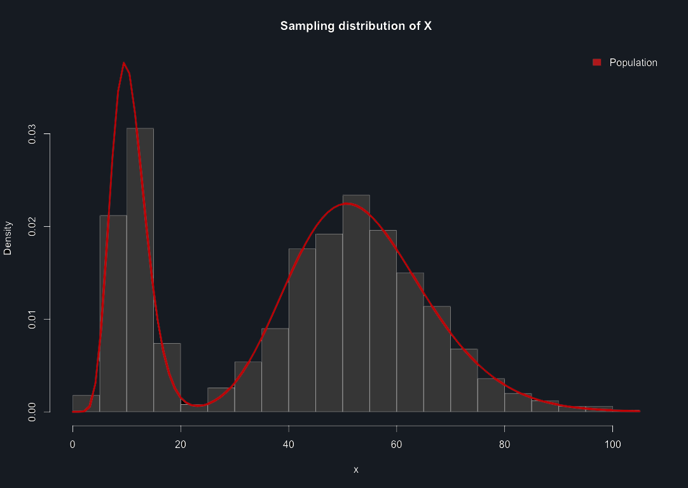
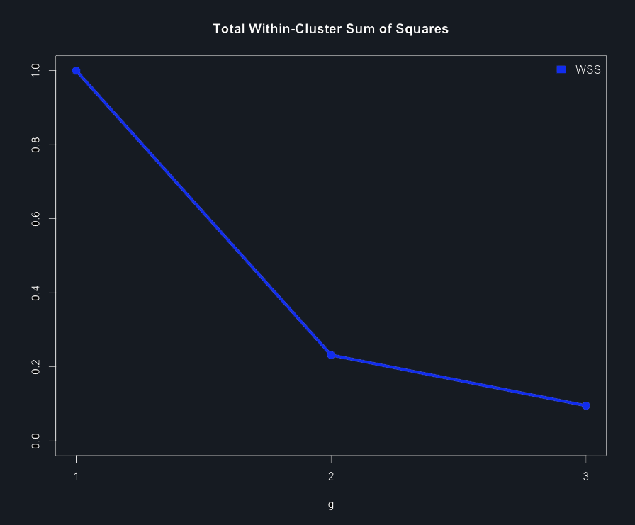
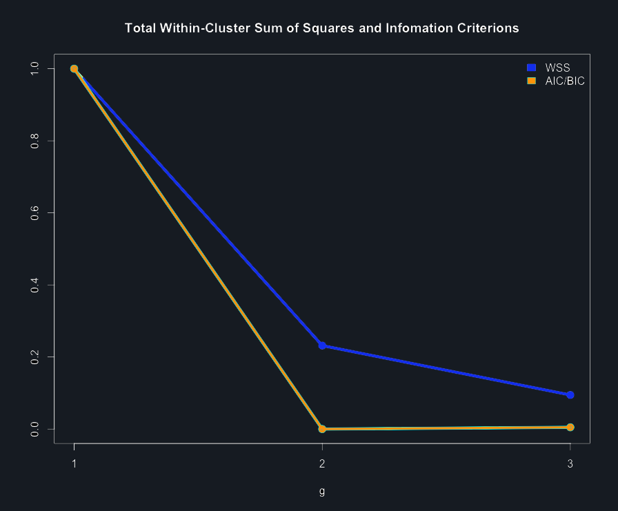
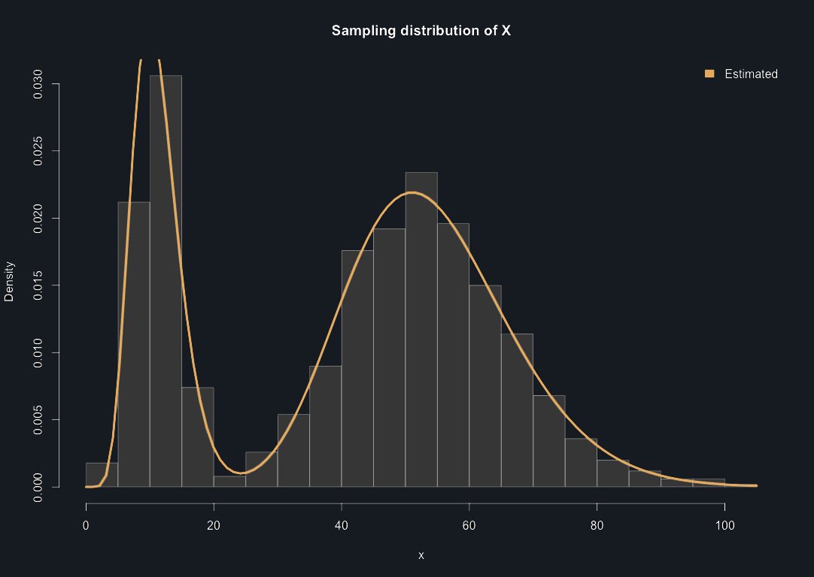

# Demonstration of package finiteMix:

## This notebook demonstrates many finiteMix features.

In actual moment, more than fifty functions are available in finiteMix. Let's use some of them.

First of all, you need the devtools package to install any package from GitHub, install or load it with:


```R
if(!suppressMessages(require(devtools))){
    install.packages(devtools); require(devtools)}
```

Now, we just need to install finiteMix :)


```R
install_github("matheuscastro43/finiteMix")
```

Loading finiteMix package..


```R
require(finiteMix)
```

    Loading required package: finiteMix
    
    You has loaded finiteMix library
    
    By Matheus Oliveira de Castro <mtcastro43@gmail.com>
    
    and Gualberto Agamez Montalvo
    


Remenber, you can use this package in your text, but do not forget to citate us


```R
citation("finiteMix")
```


    
    To cite package ‘finiteMix’ in publications use:
    
      CASTRO M. O.; MONTALVO G. S. A. (2021). finiteMix: Finite Mixture
      Models. R package version 0.5.0.
    
    A BibTeX entry for LaTeX users is
    
      @Manual{,
        title = {finiteMix: Finite Mixture Models},
        author = {CASTRO M. O.; MONTALVO G. S. A.},
        year = {2021},
        note = {R package version 0.5.0},
      }
    
    ATTENTION: This citation information has been auto-generated from the
    package DESCRIPTION file and may need manual editing, see
    ‘help("citation")’.


## Finally, let's see some examples:

## Generalized Lindley mixtures:

### It is possible get density values with "d" function


```R
dglindley_mix(x = 10, pi = c(0.3, 0.7), alpha = c(10, 17), beta = c(1, 3), gamma = c(2, 4), log = FALSE)
```


0.0375330345533306


```R
density = function(x) dglindley_mix(x, pi = c(0.3, 0.7), alpha = c(10, 17), beta = c(1, 3), gamma = c(2, 4), log = FALSE)

curve(density, 0, 90, lwd = 3, col = "navy")
```


    

    


### To get distribuction (or survival, when lower.tail = F) function values, use "p" function


```R
pglindley_mix(q = c(10, 25, 50, 80), pi = c(0.3, 0.7), alpha = c(10, 17), beta = c(1, 3), gamma = c(2, 4), lower.tail = TRUE,
          log = FALSE)
```


<style>
.list-inline {list-style: none; margin:0; padding: 0}
.list-inline>li {display: inline-block}
.list-inline>li:not(:last-child)::after {content: "\00b7"; padding: 0 .5ex}
</style>
<ol class=list-inline><li>0.137599094879368</li><li>0.301738650388426</li><li>0.587909657671024</li><li>0.978694472766959</li></ol>


```R
distribution = function(q) pglindley_mix(q, pi = c(0.3, 0.7), alpha = c(10, 17), beta = c(1, 3), gamma = c(2, 4), 
                                         lower.tail = TRUE, log = FALSE)

curve(distribution, 0, 90, lwd = 3, col = "navy")
```


    

    


### To get quantilic function values, use "q" function


```R
qglindley_mix(p = c(.25, .50, .75, .95), pi = c(0.3, 0.7), alpha = c(10, 17), beta = c(1, 3), gamma = c(2, 4), 
          lower.tail = TRUE, log = FALSE)
```


<style>
.list-inline {list-style: none; margin:0; padding: 0}
.list-inline>li {display: inline-block}
.list-inline>li:not(:last-child)::after {content: "\00b7"; padding: 0 .5ex}
</style>
<ol class=list-inline><li>13.7886513837911</li><li>45.9643806449501</li><li>57.5156423436485</li><li>73.4206581987979</li></ol>


```R
quantilic = function(p) qglindley_mix(p, pi = c(0.3, 0.7), alpha = c(10, 17), beta = c(1, 3), gamma = c(2, 4),
                                      lower.tail = TRUE, log = FALSE)

curve(quantilic, 0, 1, lwd = 3, col = "navy")
```


    

    


### To generate random values, use "r" function


```R
generating = rglindley_mix(n = 1000, pi = c(0.3, 0.7), alpha = c(10, 17), beta = c(1, 3), gamma = c(2, 4))
```


    

    


### To estimate the number of components, use g.search

#### Only using non-parametric criterions


```R
g.search(generating)
```


    $sum
        g = 1     g = 2     g = 3 
    476362.69 108193.85  41777.04 
    
    $percentageSum
     g = 1  g = 2  g = 3 
      100% 22.71%  8.77% 
    
    $plot


    

    


#### Using also parametric criterions


```R
g.search(generating, lim.em = 5, family = "Generalized Lindley")
```

    [==================================================] 100%


    $sum
        g = 1     g = 2     g = 3 
    476362.69 108193.85  41777.04 
    
    $percentageSum
     g = 1  g = 2  g = 3 
      100% 22.71%  8.77% 
    
    $AIC
       g = 1    g = 2    g = 3 
    9082.564 8264.287 8268.532 
    
    $BIC
       g = 1    g = 2    g = 3 
    9097.287 8279.010 8283.256 
    
    $plot


    

    


### To estimate the parameters, use "e" function


```R
estimating = eglindley_mix(generating, g = 2, lim.em = 100)
```

    Limit of EM Iterations (100): 
    [====                                              ] 8%


    

    


### Inside finiteMix package, the same functions presented above can be used in mixture models of distributions:
* Contaminated Normal
* Exponential
* Gama
* Generalized Lindley
* Lindley
* Normal
* Poisson
* Rectangular Beta
* Weibull
